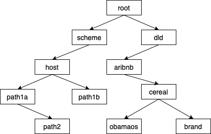

# DeepLinkDispatch

[](https://travis-ci.org/airbnb/DeepLinkDispatch)

DeepLinkDispatch provides a declarative, annotation-based API to define application deep links.

You can register an `Activity` to handle specific deep links by annotating it with `@DeepLink` and a URI.
DeepLinkDispatch will parse the URI and dispatch the deep link to the appropriate `Activity`, along
with any parameters specified in the URI.

### Example

Here's an example where we register `SampleActivity` to pull out an ID from a deep link like
`example://example.com/deepLink/123`. We annotated with `@DeepLink` and specify there will be a
parameter that we'll identify with `id`.

```java
@DeepLink("example://example.com/deepLink/{id}")
public class SampleActivity extends Activity {
  @Override protected void onCreate(Bundle savedInstanceState) {
    super.onCreate(savedInstanceState);
    Intent intent = getIntent();
    if (intent.getBooleanExtra(DeepLink.IS_DEEP_LINK, false)) {
      Bundle parameters = intent.getExtras();
      String idString = parameters.getString("id");
      // Do something with idString
    }
  }
}
```

**Note:** Only the scheme, host and path elements of the URI are used for matching the incoming deeplink to the code. Query parameters or any other part of URI are not used for matching. Query parameters are handled and available in the deep link meta data, e.g. for [method call backs](README.md#query-parameters) or when [using handlers](https://github.com/airbnb/DeepLinkDispatch/edit/master/README.md#deeplinkhandler-annotations).

### Multiple Deep Links

Sometimes you'll have an Activity that handles several kinds of deep links:

```java
@DeepLink({"foo://example.com/deepLink/{id}", "foo://example.com/anotherDeepLink"})
public class MainActivity extends Activity {
  @Override protected void onCreate(Bundle savedInstanceState) {
    super.onCreate(savedInstanceState);
    Intent intent = getIntent();
    if (intent.getBooleanExtra(DeepLink.IS_DEEP_LINK, false)) {
      Bundle parameters = intent.getExtras();
      String idString = parameters.getString("id");
      // Do something with idString
    }
  }
}
```

### DeepLinkHandler Annotations

You can annotate a Kotlin `object` that is extending `com.airbnb.deeplinkdispatch.handler.DeepLinkHandler`
with an `@DeepLink` annotation.

```kotlin
@DeepLink("foo://example.com/handlerDeepLink/{param1}?query1={queryParameter}")
object ProjectDeepLinkHandler : DeepLinkHandler<ProjectDeepLinkHandlerArgs>() {
    override fun handleDeepLink(parameters: ProjectDeepLinkHandlerArgs) {
        /**
         * From here any internal/3rd party navigation framework can be called the provided args.
         */
    }
}

data class ProjectDeepLinkHandlerArgs(
    @DeeplinkParam("param1", DeepLinkParamType.Path) val number: Int,
    @DeeplinkParam("query1", DeepLinkParamType.Query) val flag: Boolean?,
)
```

DeepLinkDispatch will then call the `handleDeepLink` function in your handler with the path placeholders
and queryParameters converted into an instance of the specified type class.

Query parameter conversion is supported for nullable and non nullable versions of `Boolean`,`Int`,
`Long`,`Short`,`Byte`,`Double`,`Float` and `String` as well as the same types in Java. For other
types see: [Type conversion](#type-conversion)

This will give compile time safety, as all placeholders and query parameters specified in the template
inside the `@DeepLink` annotation must be present in the arguments class for the processor to pass.
This is also true the other way around as all fields in the arguments class must be annotated and must
be present in the template inside the annotation.

From this function you can now call into any internal or 3rd party navigation system
without any Intent being fired at all and with type safety for your arguments.

*Note:* Even though they must be listed in the template and annotation, argument values annotated
with `DeepLinkParamType.Query` can be null as they are allowed to not be present in the matched url.

#### Type conversion

If you want to support the automatic conversions of types other than `Boolean`,`Int`,`Long`,`Short`,`Byte`,
`Double`,`Float` and `String` in deep link argument classes you can add support by adding your own type
converters in the `DeepLinkDelegate` class that you are instantiating.

Type conversion is handled via a lambda that you can set in the `DeepLinkDelegate` constructor.

All type converters you want to add get added to an instance of `TypeConverters` which then in turn
gets returned by the lambda. This way you can add type converters on the fly while the app is running
(e.g. if you just downloaded a dynamic feature which supports additional types).

There is an example of this in the `sample` app for this. Here is a brief overview:

```java
TypeConverters typeConverters = new TypeConverters();
typeConverters.put(ColorDrawable.class, value -> {
  switch (value.toLowerCase()) {
    case "red":
      return new ColorDrawable(0xff0000ff);
  }
});

Function0<TypeConverters> typeConvertersLambda = () -> typeConverters;

DeepLinkDelegate deepLinkDelegate = new DeepLinkDelegate(
  ...
  typeConvertersLambda,
  ...);
```

#### Type conversion errors

If a url parameter cannot be converted to the specified type, the system will -- by default -- set the
value to `0` or `null`, depending on if the type is nullable. However this behavior can be overwritten
by implementing a lambda `Function3<DeepLinkUri, Type, String, Integer>` and setting it to
`typeConversionErrorNullable` and/or `typeConversionErrorNonNullable` via the `DeepLinkDelegate`
constructor. When called, the lambda will let you know about the matching `DeepLinkUri` template, the
type and the value that was tried to type convert so you can also log these events.

### Method Annotations

You can also annotate any `public static` method with `@DeepLink`. DeepLinkDispatch will call that
method to create the `Intent` and will use it when starting your `Activity` via that registered deep link:

```java
@DeepLink("foo://example.com/methodDeepLink/{param1}")
public static Intent intentForDeepLinkMethod(Context context) {
  return new Intent(context, MainActivity.class)
      .setAction(ACTION_DEEP_LINK_METHOD);
}
```

If you need access to the `Intent` extras, just add a `Bundle` parameter to your method, for example:

```java
@DeepLink("foo://example.com/methodDeepLink/{param1}")
public static Intent intentForDeepLinkMethod(Context context, Bundle extras) {
  Uri.Builder uri = Uri.parse(extras.getString(DeepLink.URI)).buildUpon();
  return new Intent(context, MainActivity.class)
      .setData(uri.appendQueryParameter("bar", "baz").build())
      .setAction(ACTION_DEEP_LINK_METHOD);
}
```

If you're using Kotlin, make sure you also annotate your method with `@JvmStatic`. `companion objects` will *not work*, so you can use an `object declaration` instead:

```kotlin
object DeeplinkIntents {
  @JvmStatic 
  @DeepLink("https://example.com")
  fun defaultIntent(context: Context, extras: Bundle): Intent {
    return Intent(context, MyActivity::class.java)
  }
}
```

If you need to customize your `Activity` backstack, you can return a `TaskStackBuilder` instead of an `Intent`. DeepLinkDispatch will call that method to create the `Intent` from the `TaskStackBuilder` last `Intent` and use it when starting your `Activity` via that registered deep link:

```java
@DeepLink("http://example.com/deepLink/{id}/{name}")
public static TaskStackBuilder intentForTaskStackBuilderMethods(Context context) {
  Intent detailsIntent =  new Intent(context, SecondActivity.class).setAction(ACTION_DEEP_LINK_COMPLEX);
  Intent parentIntent =  new Intent(context, MainActivity.class).setAction(ACTION_DEEP_LINK_COMPLEX);
  TaskStackBuilder  taskStackBuilder = TaskStackBuilder.create(context);
  taskStackBuilder.addNextIntent(parentIntent);
  taskStackBuilder.addNextIntent(detailsIntent);
  return taskStackBuilder;
}
```

If, depending on app state or parameter values you have to either just start an `Intent` or a
`TaskStackBuilder`, you can return an instance of `DeepLinkMethodResult`, which can have any.
The system will pick whichever value is not null but will prefer the `TaskStackBuilder` if both
are not null.

```java
@DeepLink("dld://host/methodResult/intent")
public static DeepLinkMethodResult intentOrTaskStackBuilderViaDeeplinkMethodResult(Context context) {
  TaskStackBuilder taskStackBuilder = null;
  Intent intent = null;
  if (someState) {
    Intent detailsIntent = new Intent(context, SecondActivity.class);
    Intent parentIntent = new Intent(context, MainActivity.class);
    taskStackBuilder = TaskStackBuilder.create(context);
    taskStackBuilder.addNextIntent(parentIntent);
    taskStackBuilder.addNextIntent(detailsIntent);
  } else {
    intent = new Intent(context, MainActivity.class);
  }
  return new DeepLinkMethodResult(intent, taskStackBuilder);
}
```

### Query Parameters

Query parameters are parsed and passed along automatically, and are retrievable like any other parameter. For example, we could retrieve the query parameter passed along in the URI `foo://example.com/deepLink?qp=123`:

```java
@DeepLink("foo://example.com/deepLink")
public class MainActivity extends Activity {
  @Override protected void onCreate(Bundle savedInstanceState) {
    super.onCreate(savedInstanceState);
    Intent intent = getIntent();
    if (intent.getBooleanExtra(DeepLink.IS_DEEP_LINK, false)) {
      Bundle parameters = intent.getExtras();
      if (parameters != null && parameters.getString("qp") != null) {
        String queryParameter = parameters.getString("qp");
        // Do something with the query parameter...
      }
    }
  }
}
```

### Configurable path segment placeholders

Configurable path segment placeholders allow your to change configured elements of the URL path at runtime without changing the source of the library where the deeplink is defined. That way a library can be used in multiple apps that are still uniquely addressable via deeplinks. They are defined by encapsulating an id like this `<some_id>` and are only allowed as a path segment (between two slashes. `/`:

```java
@DeepLink("foo://cereal.com/<type_of_cereal>/nutritional_info")
public static Intent intentForNutritionalDeepLinkMethod(Context context) {
  return new Intent(context, MainActivity.class)
      .setAction(ACTION_DEEP_LINK_METHOD);
}
```

If you do this you do have to provide a mapping (at runtime) for which values are allowed for creating a match. This is done when you new the `DeeplinkDelegate` class like:

```java
@DeepLinkHandler({ AppDeepLinkModule.class, LibraryDeepLinkModule.class })
public class DeepLinkActivity extends Activity {
  @Override protected void onCreate(Bundle savedInstanceState) {
    super.onCreate(savedInstanceState);
    // Configure a map for configurable placeholders if you are using any. If you do a mapping
    // has to be provided for that are used
    Map configurablePlaceholdersMap = new HashMap();
    configurablePlaceholdersMap.put("type_of_cereal", "obamaos");
    // DeepLinkDelegate, LibraryDeepLinkModuleRegistry and AppDeepLinkModuleRegistry
    // are generated at compile-time.
    DeepLinkDelegate deepLinkDelegate = 
        new DeepLinkDelegate(new AppDeepLinkModuleRegistry(), new LibraryDeepLinkModuleRegistry(), configurablePlaceholdersMap);
    // Delegate the deep link handling to DeepLinkDispatch. 
    // It will start the correct Activity based on the incoming Intent URI
    deepLinkDelegate.dispatchFrom(this);
    // Finish this Activity since the correct one has been just started
    finish();
  }
}
```

This app will now match the Url `foo://cereal.com/obamaos/nutritional_info` to the `intentForNutritionalDeepLinkMethod` method for that app.
If you build another app and set `type_of_cereal` to `captnmaccains` that apps version of the `intentForNutritionalDeepLinkMethod` would be called when when opening `foo://cereal.com/captnmaccains/nutritional_info`

If you are using configurable path segment placeholders, a mapping has to be provided for every placeholder used. If you are missing one the app will crash at runtime.

#### Empty configurable path segment placeholders mapping

A mapping can be to an empty string, in that case the element is just ignored. In the above example if `configurablePlaceholdersMap.put("type_of_cereal", "");` is defined `foo://cereal.com/nutritional_info` would map to calling the `intentForNutritionalDeepLinkMethod` method. An empty configurable path segment placeholder is not allowed as the last path element in an URL!

### Callbacks

You can optionally register a `BroadcastReceiver` to be called on any incoming deep link into your
app. DeepLinkDispatch will use `LocalBroadcastManager` to broadcast an `Intent` with any success
or failure when deep linking. The intent will be populated with these extras:

* `DeepLinkHandler.EXTRA_URI`: The URI of the deep link.
* `DeepLinkHandler.EXTRA_SUCCESSFUL`: Whether the deep link was fired successfully.
* `DeepLinkHandler.EXTRA_ERROR_MESSAGE`: If there was an error, the appropriate error message.

You can register a receiver to receive this intent. An example of such a use is below:

```java
public class DeepLinkReceiver extends BroadcastReceiver {
  private static final String TAG = "DeepLinkReceiver";

  @Override public void onReceive(Context context, Intent intent) {
    String deepLinkUri = intent.getStringExtra(DeepLinkHandler.EXTRA_URI);
    if (intent.getBooleanExtra(DeepLinkHandler.EXTRA_SUCCESSFUL, false)) {
      Log.i(TAG, "Success deep linking: " + deepLinkUri);
    } else {
      String errorMessage = intent.getStringExtra(DeepLinkHandler.EXTRA_ERROR_MESSAGE);
      Log.e(TAG, "Error deep linking: " + deepLinkUri + " with error message +" + errorMessage);
    }
  }
}

public class YourApplication extends Application {
  @Override public void onCreate() {
    super.onCreate();
    IntentFilter intentFilter = new IntentFilter(DeepLinkHandler.ACTION);
    LocalBroadcastManager.getInstance(this).registerReceiver(new DeepLinkReceiver(), intentFilter);
  }
}
```

### Custom Annotations

You can reduce the repetition in your deep links by creating custom annotations that provide
common prefixes that are automatically applied to every class or method annotated with your custom
annotation. A popular use case for this is with web versus app deep links:

```java
// Prefix all app deep link URIs with "app://airbnb"
@DeepLinkSpec(prefix = { "app://airbnb" })
// When using tools like Dexguard we require these annotations to still be inside the .dex files
// produced by D8 but because of this bug https://issuetracker.google.com/issues/168524920 they
// are not so we need to mark them as RetentionPolicy.RUNTIME.
@Retention(RetentionPolicy.RUNTIME)
public @interface AppDeepLink {
  String[] value();
}
```

You can use placeholders (like in paths) in the scheme and host section of prefixes listed in the
`DeepLinkSpec`. e.g. if you want to match both http and https you can define it like this:

```java
// Match all deeplinks which a scheme staring with "http".
@DeepLinkSpec(prefix = { "http{url_scheme_suffix}://airbnb.com")
@Retention(RetentionPolicy.CLASS)
public @interface WebDeepLink {
  String[] value();
}
```

You will get the value of `url_scheme_suffix` which -- in this case would be "" for http and "s"
when https is used -- in the extras bundle of your annotated method. If you want to limit which
values are accepted, you can do that directly within the placeholder by defining it with allowed
values like this: `http{url_scheme_suffix(|s)}://airbnb.com`. In this case valid values would be
`""` and `"s"` (`http` and `https`). Values are pipe(`|`) separated, there can only be one `(...)`
section per placeholder and it has to be at the end of the placeholder.

```java
// Match all deeplinks which a scheme staring with "http".
@DeepLinkSpec(prefix = { "http{url_scheme_suffix(|s)}://{prefix(|www.)}airbnb.{domain(com|de)}")
@Retention(RetentionPolicy.CLASS)
public @interface WebDeepLink {
  String[] value();
}
```

The above code would match URLs that start with `http` or `https`, are for `airbnb.com` or
`airbnb.de` or `www.airbnb.com` and `www.airbnb.de`. They would e.g. not match `airbnb.ro`.

```java
// This activity is gonna handle the following deep links:
// "app://airbnb/view_users"
// "http://airbnb.com/users"
// "http://airbnb.com/user/{id}"
// "https://airbnb.com/users"
// "https://airbnb.com/user/{id}"
@AppDeepLink({ "/view_users" })
@WebDeepLink({ "/users", "/user/{id}" })
public class CustomPrefixesActivity extends AppCompatActivity {
    //...
}
```

This can be very useful if you want to use it with country prefxes in hostnames e.g.

```java
// Match all deeplinks that have a scheme starting with http and also match any deeplink that
// starts with .airbnb.com as well as ones that are only airbnb.com
@DeepLinkSpec(prefix = { "http{url_scheme_suffix}://{country_prefix}.airbnb.com",
 "http{url_scheme_suffix}://airbnb.com")
@Retention(RetentionPolicy.CLASS)
public @interface WebDeepLink {
  String[] value();
}
```

which saves you from defining a lot prefixes.

## Usage

Add to your project `build.gradle` file (Latest version is [](https://badge.fury.io/gh/airbnb%2FDeepLinkDispatch)
): 
```groovy
dependencies {
  implementation 'com.airbnb:deeplinkdispatch:x.x.x'
}
```

DeeplinkDispatch supports three ways to run the annotation processor dependin on which one you choose
the setup is slightly different.

### KSP

When using Kotlin we strongly suggest to use KSP as it can bring major speed improvements.

To run the processor via KSP you first have to apply the KSP plugin. Add the dependency to the
`build.gradle` file of your main project:

```groovy
buildscript {

    apply from: rootProject.file("dependencies.gradle")

    repositories {
        google()
        gradlePluginPortal()
    }
    dependencies {
        classpath "com.google.devtools.ksp:com.google.devtools.ksp.gradle.plugin:<ksp-version>"
    }
}
```

Apply the plugin in the `build.gradle` file of the project you want to use it:

```groovy
plugins {
  id("com.google.devtools.ksp")
}
```

and don't forget the dependency to the annotation procesor and DeepLinkDispatch itself:

```groovy
dependencies {
  implementation 'com.airbnb:deeplinkdispatch:x.x.x'
  ksp 'com.airbnb:deeplinkdispatch-processor:x.x.x'
}
```

**Note:** When using KSP (you have `ksp 'com.airbnb:deeplinkdispatch-processor:x.x.x'` in your dependencies) at least one Kotlin source file *must* be present in the project or no output will be generated!

As an example the main `sample` app is set up using KSP.

### Kapt

If your project is already setup for Kotlin the only thing you have to add is the plugin:

```groovy
plugins {
  id("kotlin-kapt")
}
```

and don't forget the dependency to the annotation procesor and DeepLinkDispatch itself:

```groovy
dependencies {
  implementation 'com.airbnb:deeplinkdispatch:x.x.x'
  kapt 'com.airbnb:deeplinkdispatch-processor:x.x.x'
}
```

As an example the `sample-kapt-library` is set up using Kapt

### Java annotation processor

Just add the dependency to DeepLinkDispatch and to the annotation processor:

```groovy
dependencies {
  implementation 'com.airbnb:deeplinkdispatch:x.x.x'
  annotationProcessor 'com.airbnb:deeplinkdispatch-processor:x.x.x'
}
```

As an example the `sample-library` is set up using the Java annotation processor

When this is done, create your deep link module(s) (**new on DeepLinkDispatch v3**). For every class you annotate with `@DeepLinkModule`, DeepLinkDispatch will generate a "Registry" class, which contains a registry of all your `@DeepLink` annotations.

```java
/** This will generate a AppDeepLinkModuleRegistry class */
@DeepLinkModule
public class AppDeepLinkModule {
}
```

**Optional**: If your Android application contains multiple modules (eg. separated Android library projects), you'll want to add one `@DeepLinkModule` class for every module in your application, so that DeepLinkDispatch can collect all your annotations in one "Registry" class per module:

```java
/** This will generate a LibraryDeepLinkModuleRegistry class */
@DeepLinkModule
public class LibraryDeepLinkModule {
}
```


Create any `Activity` (eg. `DeepLinkActivity`) with the scheme you'd like to handle in your `AndroidManifest.xml` file (using `foo` as an example):

```xml
<activity
    android:name="com.example.DeepLinkActivity"
    android:theme="@android:style/Theme.NoDisplay">
    <intent-filter>
        <action android:name="android.intent.action.VIEW" />
        <category android:name="android.intent.category.DEFAULT" />
        <category android:name="android.intent.category.BROWSABLE" />
        <data android:scheme="foo" />
    </intent-filter>
</activity>
```

Annotate your `DeepLinkActivity` with `@DeepLinkHandler` and provide it a list of `@DeepLinkModule` annotated class(es):

```java
@DeepLinkHandler({ AppDeepLinkModule.class, LibraryDeepLinkModule.class })
public class DeepLinkActivity extends Activity {
  @Override protected void onCreate(Bundle savedInstanceState) {
    super.onCreate(savedInstanceState);
    // DeepLinkDelegate, LibraryDeepLinkModuleRegistry and AppDeepLinkModuleRegistry
    // are generated at compile-time.
    DeepLinkDelegate deepLinkDelegate = 
        new DeepLinkDelegate(new AppDeepLinkModuleRegistry(), new LibraryDeepLinkModuleRegistry());
    // Delegate the deep link handling to DeepLinkDispatch. 
    // It will start the correct Activity based on the incoming Intent URI
    deepLinkDelegate.dispatchFrom(this);
    // Finish this Activity since the correct one has been just started
    finish();
  }
}
```

of 

```java
@DeepLinkHandler({ AppDeepLinkModule.class, LibraryDeepLinkModule.class })
public class DeepLinkActivity extends Activity {
  @Override protected void onCreate(Bundle savedInstanceState) {
    super.onCreate(savedInstanceState);
    // Configure a map for configurable placeholders if you are using any. If you do a mapping
    // has to be provided for that are used
    Map configurablePlaceholdersMap = new HashMap();
    configurablePlaceholdersMap.put("your_values", "what should match");
    // DeepLinkDelegate, LibraryDeepLinkModuleRegistry and AppDeepLinkModuleRegistry
    // are generated at compile-time.
    DeepLinkDelegate deepLinkDelegate = 
        new DeepLinkDelegate(new AppDeepLinkModuleRegistry(), new LibraryDeepLinkModuleRegistry(), configurablePlaceholdersMap);
    // Delegate the deep link handling to DeepLinkDispatch. 
    // It will start the correct Activity based on the incoming Intent URI
    deepLinkDelegate.dispatchFrom(this);
    // Finish this Activity since the correct one has been just started
    finish();
  }
}
```

if you use configurable path segments

### Upgrading

When upgrading to 5.x+ you may experience some breaking API changes. Read about them [here](UPGRADING.md).

### Incremental annotation processing

You must update your build.gradle to opt into incremental annotation processing. When enabled, all custom deep link annotations must be registered in the build.gradle (pipe (`|`) separated), otherwise they will be silently ignored.

Examples of this configuration are as follows: 

**Standard**
```groovy
javaCompileOptions {
  annotationProcessorOptions {
    arguments = [
      'deepLink.incremental': 'true',
      'deepLink.customAnnotations': 'com.airbnb.AppDeepLink|com.airbnb.WebDeepLink'
    ]
  }
}
```

**Kotlin kapt**
```groovy
kapt {
  arguments {
    arg("deepLink.incremental", "true")
    arg("deepLink.customAnnotations", "com.airbnb.AppDeepLink|com.airbnb.WebDeepLink")
  }
}
```

**KSP**

KSP is always incremental and you always have to provide the list of `deepLink.customAnnotation` if
you have any or they will not be processed.

```groovy
ksp {
  arg("deepLink.incremental", "true")
  arg("deepLink.customAnnotations", "com.airbnb.AppDeepLink|com.airbnb.WebDeepLink")
}
```

### Performance

Starting with v5 DeeplinkDispatch is designed to be very fast in resolving deep links even if there are a lot of them. To ensure we do not regress from this benchmark tests using [`androidx.benchmark`](https://developer.android.com/studio/profile/benchmark#top_of_page) were added.

It is testing the `ScaleTestActivity` in the `sample-benchmarkable-library` which has 2000 deep links. For those on a Pixel 2 running Android 11 we expect the following results:

```text
Started running tests

benchmark:        11,716 ns DeeplinkBenchmarks.match1
benchmark:       139,375 ns DeeplinkBenchmarks.match500
benchmark:     2,163,907 ns DeeplinkBenchmarks.newRegistry
benchmark:        23,035 ns DeeplinkBenchmarks.match1000
benchmark:       152,969 ns DeeplinkBenchmarks.match1500
benchmark:       278,906 ns DeeplinkBenchmarks.match2000
benchmark:       162,604 ns DeeplinkBenchmarks.createResultDeeplink1
benchmark:        11,774 ns DeeplinkBenchmarks.parseDeeplinkUrl
Tests ran to completion.
```

As you can see it takes us about 2ms to create the registry with 2000 entries. A lookup can be done in sub 1ms usually and `createResult`, which includes the lookup for the `match1` case plus actually calling the method that was annotated, can be done in under 0.2ms.

The performance tests can be run from Android Studio or via gradle by running `./gradlew sample-benchmark:connectedCheck` (with a device connected). The outoput can be found in `sample-benchmark/build/outputs/connected_android_test_additional_output/`.

### Notes

* Starting with DeepLinkDispatch v3, you have to **always** provide your own `Activity` class and annotate it with `@DeepLinkHandler`. It's no longer automatically generated by the annotation processor.
* Intent filters may only contain a single data element for a URI pattern. Create separate intent filters to capture additional URI patterns.
* Please refer to the [sample app](https://github.com/airbnb/DeepLinkDispatch/blob/master/sample/src/main/java/com/airbnb/deeplinkdispatch/sample/DeepLinkActivity.java) for an example of how to use the library.

Snapshots of the development version are available in
[Sonatype's `snapshots` repository](https://oss.sonatype.org/content/repositories/snapshots/).

To access the snapshots add this to your `build.gradle` file:
```groovy
repositories {
    maven {
        url "https://oss.sonatype.org/content/repositories/snapshots/"
    }
}
```


### Generated deep links Documentation

You can tell DeepLinkDispatch to generate text a document with all your deep link annotations, which you can use for further processing and/or reference.
Note: Passing a fully qualified file path string as an argument to any compilation task will cause the cache key to be non-relocateable from one machine to another.
In order to do that, add to your `build.gradle` file:
```groovy
tasks.withType(JavaCompile) {
  options.compilerArgs << "-AdeepLinkDoc.output=${buildDir}/doc/deeplinks.txt"
}
```

When using Kotlin Kapt
```groovy
kapt {
  arguments {
    arg("deepLinkDoc.output", "${buildDir}/doc/deeplinks.txt")
  }
}
```

and if you are using KSP
```groovy
ksp {
  arg("deepLinkDoc.output", "${buildDir}/doc/deeplinks.txt")
}
```

The documentation will be generated in the following format:
```
* {DeepLink1}\n|#|\n[Description part of javadoc]\n|#|\n{ClassName}#[MethodName]\n|##|\n
* {DeepLink2}\n|#|\n[Description part of javadoc]\n|#|\n{ClassName}#[MethodName]\n|##|\n
```

You can also generate the output in a much more readable Markdown format by naming the output file `*.md` (e.g. `deeplinks.md`). Make sure that your Markdown viewer understands tables.

### Matching and edge cases

Deeplink Dispatchs matching algo is designed to match non ambiguous structured URI style data very fast but because of the supported featureset it comes with some edge cases.

We organize the URI data (of all URIs that are in your app) in a tree structure that is created per module. The URI is dissolved into that tree structure and inserted into that graph at build time. We do not allow duplicates inside the tree at built time and having them will fail the build. However this is currently only guaranteed for each module not across modules.)



At runtime we traverse the graph for each module to find the correct action to undertake. The algo just walks the input URI until the last element and *never* backtracks inside the graph. The children of each element are checked for matches in alphabetic order:  

`elements without any variable element -> elements containing placeholders -> elements that are a configurable path segment`

#### Edge cases

* Duplicates can exist between modules. Only the first one found will be reported as a match. Modules are processed in the order the module registries are listed in your `DeepLinkDelegate` creation.
* Placeholders can lead to duplications at runtime e.g. `dld://airbnb/dontdupeme` will match both `@Deeplink('dld://airbnb/{qualifier}dupeme')` and `@Deeplink('dld://airbnb/dontdupeme')`. They can both be defined in the same module as they are not identical. If they are defined in the same module the algo will match `@Deeplink('dld://airbnb/dontdupeme')` as it would check litereal matches before looking at elements containing placeholders. If they are not defined in the same module the one defined in the registry listed first in `DeeplinkDelegate` will be matched.
* Configurable path segments can lead to duplicates. e.g. `dld://airbnb/obamaos/cereal` will match both  `@Deeplink('dld://airbnb/obamaos/cereal/')` and `@Deeplink('dld://airbnb/<brand>/cereal')` if `<brand>` is configured to be `obamaos`. The same match rules as mentioned before apply here.
* Configurable path segments can have empty values e.g. `<brand>` can be set to `""` in the previous example. Which would then match `dld://airbnb/cereal`. If a deeplink like that is defined already somewhere else the same match rules as mentioned before apply to which match actually gets found.
* Because of limitations of the algo the last path element (the item behind the last slash) cannot  be a configurable path segment with it's value set to `""`. Currently the system will allow you to do this but will not correctly match in that case.

## Proguard/R8 Rules

The Proguard/R8 rules mandatory for teh lib are defined in the [proguard-rules.pro](deeplinkdispatch/proguard-rules.pro) in `deeplinkdispatch`. However
they are already included via `consumerProguardFiles` so there is nothing you have to do to include them.

Please note however that you must add your own Proguard/R8 rules to keep Custom annotations you have used. For example:

```
-keep @interface your.package.path.deeplink.<annotation class name>
-keepclasseswithmembers class * {
    @your.package.path.deeplink.<annotation class name> <methods>;
}
```

## Testing the sample app

Use adb to launch deep links (in the terminal type: `adb shell`).

This fires a standard deep link. Source annotation `@DeepLink("dld://example.com/deepLink")`

`am start -W -a android.intent.action.VIEW -d "dld://example.com/deepLink" com.airbnb.deeplinkdispatch.sample`

This fires a deep link associated with a method, and also passes along a path parameter. Source annotation `@DeepLink("dld://methodDeepLink/{param1}")`

`am start -W -a android.intent.action.VIEW -d "dld://methodDeepLink/abc123" com.airbnb.deeplinkdispatch.sample`

You can include multiple path parameters (also you don't have to include the sample app's package name). Source annotation `@DeepLink("http://example.com/deepLink/{id}/{name}")`

`am start -W -a android.intent.action.VIEW -d "http://example.com/deepLink/123abc/myname"`


Note it is possible to call directly `adb shell am ...` however this seems to miss the URI sometimes so better to call from within shell.

## License

```
Copyright 2015-2020 Airbnb, Inc.

Licensed under the Apache License, Version 2.0 (the "License");
you may not use this file except in compliance with the License.
You may obtain a copy of the License at

   http://www.apache.org/licenses/LICENSE-2.0

Unless required by applicable law or agreed to in writing, software
distributed under the License is distributed on an "AS IS" BASIS,
WITHOUT WARRANTIES OR CONDITIONS OF ANY KIND, either express or implied.
See the License for the specific language governing permissions and
limitations under the License.
```
